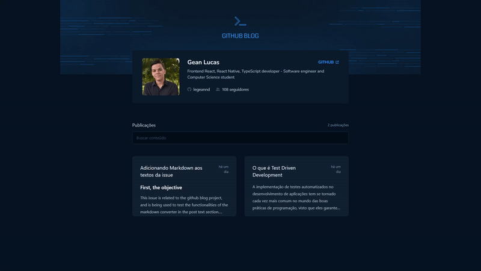

<p align="center">
  
</p>

# [GitHub Blog](https://github-blog-legeannd.vercel.app/)
        

<p align="center">
  
</p>


* [Content (en-US)](#section-en_us)
* [Conteúdo (pt-BR)](#secao-pt_br)

---

## About the project <a id="section-en_us"></a>

This app uses the issues system from its GitHub repository to create blog posts, so all issues created in the blog project's repository are turned into new posts automatically through the app. The project uses Axios to make requests to the GitHub API and retrieve user information and the repo issues, and uses React Markdown to automatically convert the markdown that comes from the API to the blog with the corresponding elements. Additionally, it uses the React Router DOM layout system to reuse common components across different routes.

## Content
  * [Techs](#techs)
  * [How to run the project](#installation)
    * [Installation - Frontend](#installation-front)

## Techs <a id="techs"></a>

- [x] React
- [x] Tailwind
- [x] Axios
- [x] React Markdown

## How to execute the project <a id="installation"></a>
To execute the project, you'll need to have Node and NPM or Yarn installed to setup all the dependencies.


### Installation - Front-end (Web) <a id="installation-front"></a>

In the project root folder:

```bash
npm install
npm run dev
```

If you are using Yarn, use this:
```bash
yarn install
yarn dev
```

<!-- Remember to create a .env file to put the enviroment variables exemplified in the .env.example file with your personal data. -->

After finishing installation, the web page will be open in your browser.

---

## Sobre o projeto <a id="secao-pt_br"></a>

Este aplicativo utiliza o sistema de issues do seu repositório no GitHub para criar os posts do blog, então todas as issues criadas no repositório do projeto do blog são transformadas em novos posts automaticamente através do app. O projeto utiliza Axios para fazer as requisições à API do GitHub e recuperar as informações do usuário e as issues do repositório, e utiliza o React Markdown para converter automaticamente o markdown que vem da API para o blog com os elementos correspondentes. Além disso, utiliza o sistema de layouts do React Router DOM para reutilizar componentes comuns em diferentes rotas. 

## Conteúdos
  * [Tecnologias](#tecnologias)
  * [Como executar o projeto](#instalacao)
    * [Instalação - Front-end](#instalacao-front)

## Tecnologias <a id="tecnologias"></a>

- [x] React
- [x] Tailwind
- [x] Axios
- [x] React Markdown

## Como executar o projeto <a id="instalacao"></a>
Para executar o projeto, você irá precisar ter o Node e o NPM ou Yarn instalados para baixar as dependências.


### Instalação - Front-end (Web) <a id="instalacao-front"></a>

Na pasta raíz do repositório:

```bash
npm install
npm run dev
```

Se estiver usando Yarn, utilize
```bash
yarn install
yarn dev
```

<!-- Lembre-se de criar um arquivo .env para colocar as variáveis de ambiente exemplificadas no arquivo .env.example com os seus dados pessoais. -->

Quando terminar, a página da aplicação web será aberta no navegador.

---
###### Developed by [Gean Lucas](https://www.linkedin.com/in/geanlucaas/) :rocket:.